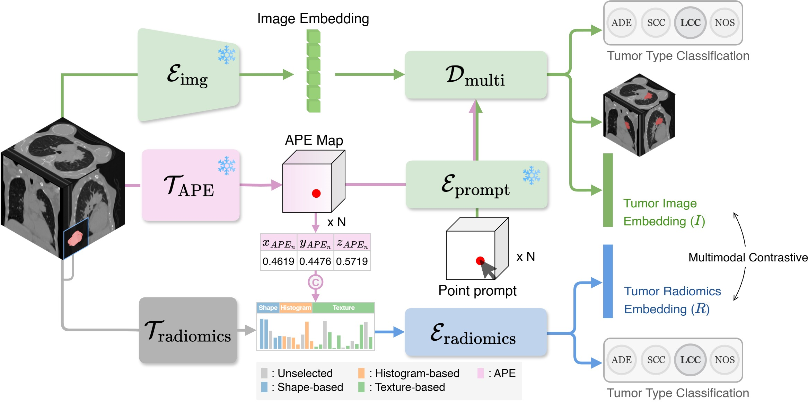

# RadiomicsRetrieval: A Customizable Framework for Medical Image Retrieval Using Radiomics Features

:fire:  Official implementation of "RadiomicsRetrieval: A Customizable Framework for Medical Image Retrieval Using Radiomics Features" (MICCAI 2025)

## Datasets

This project utilizes publicly available medical imaging datasets. You can download them from the following sources:

### :brain: Brain Tumor MRI
- [Adult Glioma (GLI)](https://www.synapse.org/Synapse:syn51156910/wiki/622351)
- [Meningioma (MEN)](https://www.synapse.org/Synapse:syn51156910/wiki/622353)
- 
### :lungs: Lung Tumor CT
- [NSCLC-Radiomics](https://www.cancerimagingarchive.net/collection/nsclc-radiomics/)
- [NSCLC-Radiomics-Interobserver1](https://www.cancerimagingarchive.net/collection/nsclc-radiomics-interobserver1/)
- [RIDER-LungCT-Seg](https://www.cancerimagingarchive.net/collection/rider-lung-ct/)
- [NSCLC Radiogenomics](https://www.cancerimagingarchive.net/collection/nsclc-radiogenomics/)
- [LUNG-PET-CT-Dx](https://www.cancerimagingarchive.net/collection/lung-pet-ct-dx/)

## Contact

For any inquiries or support, please contact us at `niy0404@gmail.com`.
