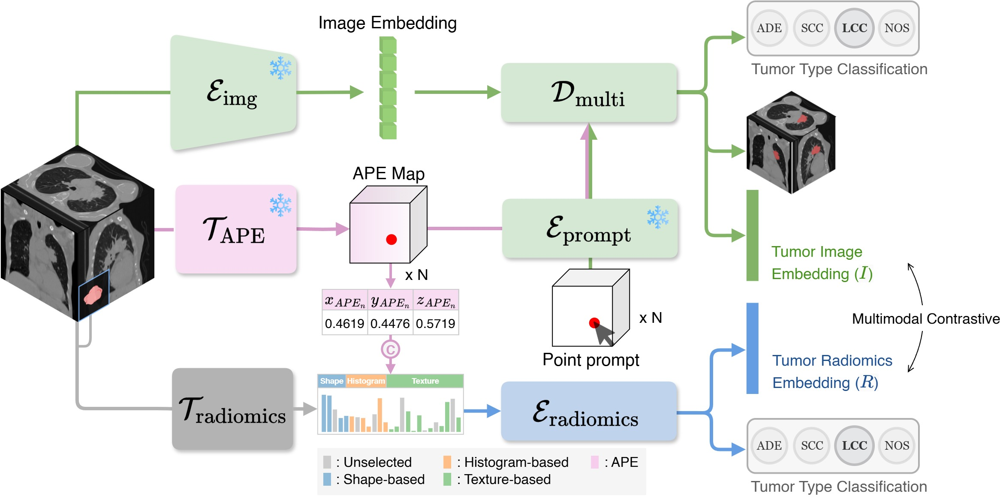

# RadiomicsRetrieval: A Customizable Framework for Medical Image Retrieval Using Radiomics Features

:fire:  Official implementation of "RadiomicsRetrieval: A Customizable Framework for Medical Image Retrieval Using Radiomics Features" (MICCAI 2025)

[](https://arxiv.org/pdf/2507.08546.pdf)



## Datasets

This project utilizes publicly available medical imaging datasets. You can download them from the following sources:

### :lungs: Lung Tumor CT
- [NSCLC-Radiomics](https://www.cancerimagingarchive.net/collection/nsclc-radiomics/)
- [NSCLC-Radiomics-Interobserver1](https://www.cancerimagingarchive.net/collection/nsclc-radiomics-interobserver1/)
- [RIDER-LungCT-Seg](https://www.cancerimagingarchive.net/collection/rider-lung-ct/)
- [NSCLC Radiogenomics](https://www.cancerimagingarchive.net/collection/nsclc-radiogenomics/)
- [LUNG-PET-CT-Dx](https://www.cancerimagingarchive.net/collection/lung-pet-ct-dx/)
  
### :brain: Brain Tumor MRI
- [Adult Glioma (GLI)](https://www.synapse.org/Synapse:syn51156910/wiki/622351)
- [Meningioma (MEN)](https://www.synapse.org/Synapse:syn51156910/wiki/622353)


## Usage

### Installation

To set up your development environment, follow the steps below:

1. **Pull the Docker image:**

    We are using the `pytorch/pytorch:2.3.1-cuda12.1-cudnn8-devel` Docker image. You can pull it from Docker Hub by running:

    ```sh
    docker pull pytorch/pytorch:2.3.1-cuda12.1-cudnn8-devel
    ```

2. **Run the Docker container:**

    Start a container from the pulled image. You can mount your project directory into the container for easy development:

    ```sh
    docker run --shm-size=192gb --gpus=all -it -v /path/to/your/project/:/workspace --name radiomicsretrieval pytorch/pytorch:2.3.1-cuda12.1-cudnn8-devel /bin/bash
    ```

    Replace `/path/to/your/project` with the actual path to your project directory.

3. **Set up the Python environment:**

    Inside the container, clone this repository and install the required dependencies:

    ```sh
    git clone https://github.com/nainye/RadiomicsRetrieval.git && cd RadiomicsRetrieval
    pip install -r requirements.txt
    ```

### Data Preprocessing
To preprocess the datasets, run the following notebooks:

#### :lungs: Lung Tumor CT (NSCLC)
  [source/preprocessing_NSCLC.ipynb](source/preprocessing_NSCLC.ipynb)

#### :brain: Brain Tumor MRI (BraTS)    
  Preprocessing notebook is under construction and will be uploaded soon.

### Model Training

#### Common Setup

Before training the model, please download the SAM-Med3D checkpoint and place it as follows:

  - 🔗 [Download `sam_med3d_turbo.pth`](https://huggingface.co/blueyo0/SAM-Med3D/blob/main/sam_med3d_turbo.pth)
  - Save it to:
     ```
     ./source/sam_med3d_turbo.pth
     ```
#### :lungs: Lung Tumor CT (NSCLC)

To train the model on NSCLC CT data, run the following script:

  ```sh
  ./scripts/run_train_RadiomicsRetireval_NSCLC_Img+Rad_withAPE.sh
  ```

     
#### :brain: Brain Tumor MRI (BraTS)  
Training code for brain tumor retrieval is under construction and will be uploaded soon.

### Released Checkpoints

#### :lungs: Lung Tumor CT (NSCLC)
  - 🔗 [Download checkpoint](https://drive.google.com/file/d/16c-LM23X0J3vMcnxGMgmbmefxS9mfKKQ/view?usp=sharing)

#### :brain: Brain Tumor MRI (BraTS)
  - 🔗 [Download checkpoint](https://drive.google.com/file/d/1VRkXb5XHzYo5OmwgHDc-RooMxQET8-Km/view?usp=sharing)


### Retrieval

After training (or downloading a checkpoint), build a sample-embedding DB and query it.

#### :lungs: Lung Tumor CT (NSCLC)

##### 1. Build the embedding DB

```sh
./scripts/run_build_db.sh
```

Runs every sample in `data/NSCLC/train.jsonl` through the image encoder and writes the DB to `results/checkpoint-lung/db/`:

```
img_embeddings/<id>.npy           # image embedding per sample
radiomics_normalized.json         # 72 normalized radiomics features
feature_names.json
gt_labels.json
radiomics_features_min_max.json
skipped.json
```

Samples without a matching image / seg / APE file are skipped, so you can re-run the script later to fill in the gaps. Edit [`scripts/run_build_db.sh`](scripts/run_build_db.sh) to change the jsonl, data root, checkpoint, or GPU.

##### 2. Query the DB

```sh
./scripts/run_retrieve.sh
```

Set `MODE` to choose the search space:

| Mode | Search space |
|---|---|
| `img` | Image embedding |
| `rad` | All 72 radiomics features |
| `shape` | 14 Shape features |
| `firstorder` | 18 First-order features |
| `texture` | GLCM ∪ GLSZM (40 features) |
| `glcm` / `glszm` | Single texture family |
| `feature` | One feature, set by `FEATURE_NAME` |

Two ways to specify the query:

- Set `QUERY_ID=LUNG1-001_1` to use a sample already in the DB.
- Leave `QUERY_ID` blank and set `IMAGE`, `SEG`, and (for `MODE=img`) `APE` to use an external sample. `QUERY_LABEL` is optional.

Each result shows the embedding similarity (`emb`), raw 72-feature radiomics cosine (`raw`), and label match:

```
[result] mode=shape, query_label=ADC, top-5:
   1. LUNG1-042_1             emb=+0.8731  raw=+0.6402  label=ADC  ✓
   2. LUNG1-114_1             emb=+0.8520  raw=+0.5810  label=SCC
   3. LUNG1-077_2             emb=+0.8431  raw=+0.7152  label=ADC  ✓
   ...
```

For non-`img` modes, the DB is forwarded through transtab once and cached at `<db>/_cache_<mode>.npy`.


## Citation
If you use this code for your research, please cite our papers.

**BibTeX:**
```bibtex
@inproceedings{na2025radiomicsretrieval,
  title={RadiomicsRetrieval: A Customizable Framework for Medical Image Retrieval Using Radiomics Features},
  author={Na, Inye and Rue, Nejung and Chung, Jiwon and Park, Hyunjin},
  booktitle={International Conference on Medical Image Computing and Computer-Assisted Intervention},
  pages={556--566},
  year={2025},
  organization={Springer}
}
```

## Contact

For any inquiries or support, please contact us at `niy0404@gmail.com`.
